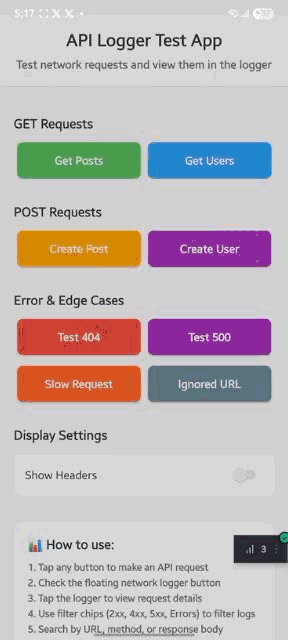

# React Native API Debugger

A network request debugging tool for React Native applications. Monitor, inspect, and debug HTTP requests with a draggable overlay interface.

[](https://www.npmjs.com/package/react-native-api-debugger)
[](https://www.npmjs.com/package/react-native-api-debugger)
[](https://github.com/cmcWebCode40/react-native-api-debugger/blob/main/LICENSE)



## Features

- **Network Interception** - Automatically captures all `fetch()` and `XMLHttpRequest` calls
- **Draggable Overlay** - Floating button that can be positioned anywhere on screen
- **Request Details** - View headers, body, response, timing, and status codes
- **cURL Export** - Copy requests as cURL commands
- **Advanced Filtering** - Filter by status code (2xx, 3xx, 4xx, 5xx), search by URL/method/body
- **Export Logs** - Export to HAR, Postman Collection, or JSON formats
- **Request Replay** - Re-execute captured requests with optional modifications
- **Dark/Light Theme** - Toggle between themes
- **Slow Request Detection** - Visual indicator for requests exceeding threshold
- **Sensitive Data Redaction** - Detect and mask sensitive headers and body fields
- **Individual Log Deletion** - Remove specific entries without clearing all logs
- **Device Shake Support** - Shake to show/hide the debugger
- **TypeScript Support** - Full type definitions included

## Installation

```bash
npm install react-native-api-debugger
# or
yarn add react-native-api-debugger
```

### Optional Peer Dependencies

Install only what you need:

| Package | Required For |
|---------|--------------|
| `react-native-gesture-handler` | Draggable floating button |
| `react-native-reanimated` | Smooth drag animations |
| `react-native-shake` | Device shake detection |
| `@react-native-clipboard/clipboard` | Copy to clipboard |

```bash
# For draggable button
npm install react-native-gesture-handler react-native-reanimated

# For device shake
npm install react-native-shake

# For clipboard
npm install @react-native-clipboard/clipboard
```

> For Expo SDK ≤ 53, use `react-native-reanimated` version 3.x.x

---

## Quick Setup

### 1. Basic Usage (No Dependencies)

```tsx
import React, { useEffect } from 'react';
import { View } from 'react-native';
import { networkLogger, NetworkLoggerOverlay } from 'react-native-api-debugger';

export default function App() {
  useEffect(() => {
    networkLogger.setupInterceptor();
  }, []);

  return (
    <View style={{ flex: 1 }}>
      {/* Your app content */}
      
      <NetworkLoggerOverlay
        networkLogger={networkLogger}
        draggable={false}
        enableDeviceShake={false}
        useCopyToClipboard={false}
      />
    </View>
  );
}
```

### 2. With Draggable Button

Requires `react-native-gesture-handler` and `react-native-reanimated`.

```tsx
import { GestureHandlerRootView } from 'react-native-gesture-handler';
import { networkLogger, NetworkLoggerOverlay } from 'react-native-api-debugger';

export default function App() {
  useEffect(() => {
    networkLogger.setupInterceptor();
  }, []);

  return (
    <GestureHandlerRootView style={{ flex: 1 }}>
      {/* Your app content */}
      
      <NetworkLoggerOverlay
        networkLogger={networkLogger}
        draggable={true}
      />
    </GestureHandlerRootView>
  );
}
```

### 3. Full Featured Setup

```tsx
<NetworkLoggerOverlay
  networkLogger={networkLogger}
  draggable={true}
  enableDeviceShake={true}
  useCopyToClipboard={true}
  showRequestHeader={true}
  showResponseHeader={true}
  theme="light"
  onThemeChange={(theme) => console.log('Theme:', theme)}
/>
```

---

## Advanced Usage

### Configuration Options

Configure the interceptor with custom settings:

```tsx
import { networkLogger } from 'react-native-api-debugger';

useEffect(() => {
  networkLogger.configure({
    maxLogs: 50,                      // Maximum logs to store (default: 100)
    ignoredUrls: ['/health', '/ping'], // URL patterns to ignore
    ignoredDomains: ['analytics.example.com'],
    ignoredMethods: ['OPTIONS'],       // HTTP methods to ignore
    slowRequestThreshold: 2000,        // Mark requests slower than 2s
  });
  
  networkLogger.setupInterceptor();
}, []);
```

### NetworkLogger Methods

```tsx
import { networkLogger } from 'react-native-api-debugger';

// Initialize interception
networkLogger.setupInterceptor();

// Get all logs
const logs = networkLogger.getLogs();

// Get log count
const count = networkLogger.getLogCount();

// Clear all logs
networkLogger.clearLogs();

// Delete a specific log
networkLogger.deleteLog(logId);

// Enable/disable logging
networkLogger.enable();
networkLogger.disable();

// Check if enabled
const isEnabled = networkLogger.isLoggerEnabled();

// Update configuration
networkLogger.configure({ maxLogs: 200 });

// Get current configuration
const config = networkLogger.getConfig();
```

### Subscribe to Log Changes

```tsx
useEffect(() => {
  const unsubscribe = networkLogger.subscribe((logs) => {
    console.log('Logs updated:', logs.length);
  });
  
  return () => unsubscribe();
}, []);
```

### Export Utilities

```tsx
import { exportToHAR, exportToPostman, exportLogs } from 'react-native-api-debugger';

const logs = networkLogger.getLogs();

// Export to HAR format (for browser DevTools)
const harContent = exportToHAR(logs);

// Export to Postman Collection
const postmanContent = exportToPostman(logs, 'My API Collection');

// Export to JSON
const jsonContent = exportLogs(logs, 'json');
```

### Request Replay

```tsx
import { replayRequest, canReplayRequest, getReplayWarnings } from 'react-native-api-debugger';

const log = networkLogger.getLogs()[0];

// Check if request can be replayed
if (canReplayRequest(log)) {
  // Get warnings (e.g., "This request may modify data")
  const warnings = getReplayWarnings(log);
  
  // Replay with optional modifications
  const result = await replayRequest(log, {
    modifyHeaders: { 'Authorization': 'Bearer new-token' },
    timeout: 5000,
  });
  
  if (result.success) {
    console.log('Response:', result.response);
  }
}
```

### Sensitive Data Detection

```tsx
import { detectSensitiveData, redactNetworkLog } from 'react-native-api-debugger';

const log = networkLogger.getLogs()[0];

// Check for sensitive data
const info = detectSensitiveData(log);
if (info.hasSensitiveHeaders) {
  console.log('Contains sensitive headers');
}

// Redact sensitive data before sharing
const redactedLog = redactNetworkLog(log, { enabled: true });
```

### cURL Generation

```tsx
import { generateCurl } from 'react-native-api-debugger';

const log = networkLogger.getLogs()[0];
const curlCommand = generateCurl(log);
// curl -X POST 'https://api.example.com/users' -H 'Content-Type: application/json' -d '{"name":"John"}'
```

---

## API Reference

### NetworkLoggerOverlay Props

| Prop | Type | Default | Description |
|------|------|---------|-------------|
| `networkLogger` | `NetworkLogger` | Required | The logger instance |
| `enabled` | `boolean` | `__DEV__` | Enable/disable the overlay |
| `draggable` | `boolean` | `false` | Enable draggable button |
| `enableDeviceShake` | `boolean` | `false` | Show on device shake |
| `useCopyToClipboard` | `boolean` | `false` | Enable clipboard copy |
| `showRequestHeader` | `boolean` | `false` | Show request headers |
| `showResponseHeader` | `boolean` | `false` | Show response headers |
| `theme` | `'light' \| 'dark'` | `'light'` | Color theme |
| `onThemeChange` | `(theme) => void` | - | Theme change callback |

### NetworkLoggerConfig

| Option | Type | Default | Description |
|--------|------|---------|-------------|
| `maxLogs` | `number` | `100` | Maximum logs to store |
| `ignoredUrls` | `string[]` | `[]` | URL patterns to ignore |
| `ignoredDomains` | `string[]` | `[]` | Domains to ignore |
| `ignoredMethods` | `string[]` | `[]` | HTTP methods to ignore |
| `redactHeaders` | `string[]` | `['Authorization', ...]` | Headers to redact |
| `enableRedaction` | `boolean` | `false` | Enable auto-redaction |
| `slowRequestThreshold` | `number` | `3000` | Slow request threshold (ms) |

### NetworkLog Type

```typescript
interface NetworkLog {
  id: number;
  method: string;
  url: string;
  headers: Record<string, string>;
  body: string | null;
  timestamp: string;
  startTime: number;
  response?: {
    status: number;
    statusText: string;
    headers: Record<string, string>;
    body: string;
    duration: number;
  };
  error?: string;
  duration?: number;
  isSlow?: boolean;
  bookmarked?: boolean;
}
```

---

## Production Safety

The overlay is disabled by default in production (`enabled` defaults to `__DEV__`). To explicitly control:

```tsx
<NetworkLoggerOverlay
  networkLogger={networkLogger}
  enabled={__DEV__}  // Only in development
/>
```

For staging environments:

```tsx
const showDebugger = __DEV__ || process.env.STAGING === 'true';

<NetworkLoggerOverlay
  networkLogger={networkLogger}
  enabled={showDebugger}
/>
```

---

## Troubleshooting

### Draggable button not working

Ensure your app is wrapped with `GestureHandlerRootView`:

```tsx
import { GestureHandlerRootView } from 'react-native-gesture-handler';

export default function App() {
  return (
    <GestureHandlerRootView style={{ flex: 1 }}>
      {/* App content */}
    </GestureHandlerRootView>
  );
}
```

### Share sheet not appearing

The share sheet requires the main modal to close first. This is handled automatically - ensure you're using the latest version.

### Requests not being captured

Make sure `setupInterceptor()` is called before any network requests:

```tsx
useEffect(() => {
  networkLogger.setupInterceptor();
}, []); // Empty dependency array - runs once on mount
```

---

## Contributing

1. Fork the repository
2. Create a feature branch: `git checkout -b feature/my-feature`
3. Make changes and run tests: `yarn test`
4. Commit: `git commit -m 'Add my feature'`
5. Push: `git push origin feature/my-feature`
6. Open a Pull Request

### Development

```bash
git clone https://github.com/cmcWebCode40/react-native-api-debugger.git
cd react-native-api-debugger
yarn install

# Run example app
cd example
yarn install
yarn ios  # or yarn android
```

---

## License

MIT License - see [LICENSE](LICENSE) for details.

## Support

- Bug Reports: [GitHub Issues](https://github.com/cmcWebCode40/react-native-api-debugger/issues)
- Feature Requests: [GitHub Discussions](https://github.com/cmcWebCode40/react-native-api-debugger/discussions)
